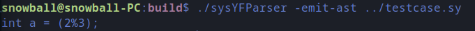

### 问题1-1

各个节点类的结构：

* 存放一些简单信息的数据域(存放`std::string`的name域，`bool`类型的is_inited域等)
* 存放指向其他类型节点的指针的一个指针列表
* `accept(Visitor &visitor)`接口

`SyntaxTreePrinter.cpp`中`visitor`方法的实现特点：

* 对简单数据域的信息直接打印或者经过一些简单处理(访问map获取value、调整缩进、添加花括号等)后打印
* 对指向其他类型节点的指针列表依次调用它们的`accept()`方法，递归访问其他节点

例如：

* VarDef

    VarDef节点类包含定义一个变量所需要的6个数据域：is_constant、btype、name、is_inited、array_length、initializers。`visitor`访问每个数据域，打印const标识、变量类型、变量名，array_length和initializers是指向其他节点类的指针列表，就调用`accept()`方法，访问Expr节点类和InitVal节点类。

* InitVal

    InitVal节点类有3个数据域：isExp、elemntList和expr。`visitor`打印该类节点时根据isExp来打印elementList或expr，isExp为true时调用`accept()`访问expr节点，isExp为false时调用`accept()`访问elementList中的每一个节点。

* FuncDef

    FuncDef节点类包含定义一个函数所需要的4个数据域：ret_type(返回值类型)、param_list(参数列表)、name(函数名)和body(函数体)，其`visitor`执行的操作就是把这些域的内容打印出来。通过直接访问一个`map<Type, std::string>`获取ret_type对应的返回值类型的字符串形式，从节点的name域可以直接获取函数名字符串，通过param_list域的`accept()`方法打印参数列表，通过body域的`accept()`方法打印函数体的内容。

* BlockStmt

    BlockStmt节点类只有一个数据域：body(该block中所有Stmt指针的列表)。`visitor`最开始先打印缩进，然后开始打印语句块，打印`{`后另起一行，缩进加4，然后对该语句块中的每条语句(指针)调用其`accept()`方法打印每条语句，最后打印缩进后的`}`。

### 问题1-2

编译运行项目提供的SysYF解析器，处理`testcase.sy`：



### 问题3-1

1. 实验过程中遇到的困难：

    * 时间紧张，与多门其他课的期中考试撞同一周
    * 读懂实验要求，理解项目中各个文件之间的关系
    * 理清楚怎么一步一步实现所要求的任务
    * debug

    解决方案：

    * 结合老师上课讲的内容，自己好好认真思考
    * 与其他同学讨论交流
    * 耐心debug

2. 实验难点与考察倾向

    * 符号表的设计
    * 识别作用域
    * 各个节点类对应的`visitor`实现
    * 要把所有可能需要检查的地方都考虑到

3. 整体实现思路与实现亮点

    * 符号表用一个类来实现，这个类的主要数据域是一个`std::map<std::string, attr>`，使用标识符的名字(string类型)来索引其属性(attr类型)

    * `attr`是自定义的一个结构体，map中一个item所含的属性

    	```cpp
    	struct attr {
    	  	bool isVar;				// 指示该条目是否是一个变量
    	  	bool isFunc; 			// 指示该条目是否是一个函数 
    	    SyntaxTree::Type type;	// 变量的数据类型或函数的返回值类型
    	    std::vector<SyntaxTree::Type> FParamList; // 函数条目的各个形参的数据类型，变量条目的该域为空
    	};
    	```

    * 在使用`SyntaxTreeChecker`类访问各个节点的过程中，用一个全局变量`int currentfield`指示当前作用域，初始值为0，进入一个 `{` 就自增一次，表示进入了更深一层的作用域，遇到 `}` 时自减一次，表示退出了当前的作用域

    * 针对各个节点类的具体特点编写对应的`visitor`

### 问题3-2

处理变量声明时应该先把该变量加入符号表，因为变量声明可以不进行初始化，其其值可以通过后面的赋值语句添加；处理函数定义时先把函数名加入符号表，否则不能处理函数递归调用的情况。

### 问题3-3

1. 具体的检查操作是基于AST完成而不是让AST适应每一个具体的检查操作，那样的话，当要进行检查的方面多了的时候，例如，如果要进一步判断表达式是否为string类型、是否为float类型等等，AST就会变得非常庞大。而且，表达式的类型需要根据操作符和操作数的类型来决定，在生成语法树时需要做这一部分的计算，会增加生成语法树的时间和空间开销。
2. 拆成多个检查类的话，每次检查一个节点，需要对每个检查类都调用一次`accept()`，会增加函数调用的开销。

### 问题3-4

用一个vector存放所识别出来的语义错误和位置信息，遇到不是`ErrorType::Modulo`的错误时就先push_back，遇到第一个`ErrorType::Modulo`时就报错，如果到最后都没有`ErrorType::Modulo`，就报最早识别的(下标为0)语义错误。
