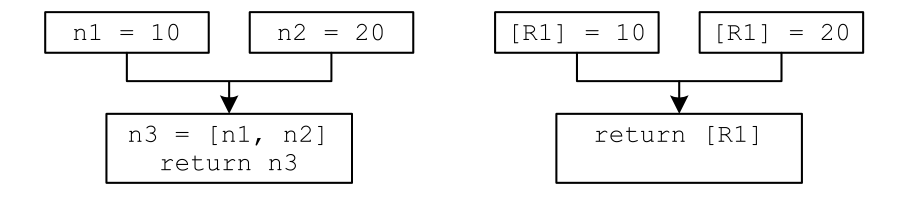

# 低级中间代码(LIR)生成（选做）

> 负责助教：万嘉诚

[toc]

### 实验目标

本实验截取了从`LLVM IR`生成汇编码的一部分内容，具体内容为：从`LLVM IR`生成`LIR`，这个`LIR`具有如下特征:

1. 其打印输出的指令形式为`ARM `汇编码，没有`Phi`；
2. 其主要采用虚拟寄存器的形式保存变量，虚拟寄存器用`v+数字`表示，但在函数调用时，对于前四个参数，仍然需要将其`MOV`到物理寄存器`r0-r3`的操作；
3. 相较汇编码没有维护调用栈与现场保护。注意：
   1. 具体来说，是没有进出函数的`push`与`pop`寄存器的操作，没有维护栈帧指针，没有保存返回值
   2. 前四个参数通过物理寄存器`r0-r3`正常传入，而其余参数则是以虚拟寄存器的形式直接传递到被调用函数处

### 具体任务

1. 阅读并理解`LIRBuilder`中所提供的相关函数，浏览并学会调用`IR`及`pass`路径下提供的接口
   1. 本实验提供了详尽的各种调用函数，理论上你只需要修改各个`TODO`所在的`block`即可完成

2. 完成`LIRBuilder::build()`函数中的`TODO`部分
3. 完成`LIRBuilder::buildInstr`函数中`case Instruction::call: `的`TODO`部分
   1. 这里你需要考虑多维数组作为参数传入的情况

4. 你需要自行设计一部分测试样例以展示实验成果

### 简介

#### LIR简介

低级中间表示(`LIR`)在概念上非常类似于汇编码，但是其指令和操作数在所有平台之间共享，可移植性很好。相较于高层中间表示`HIR`（例如基于`LLVM`的`IR`），`LIR`更加适合寄存器分配，因为汇编码中需要寄存器的所有操作数在`LIR`中都是显式可见的。

##### LIROperand

`LIR`的操作数必须能够建模目标体系结构中可用的所有操作数和寻址模式。在`ARM`的情境下，`LIR`的操作数分为如下几类：

1. 虚拟寄存器：指向最终位置未知的操作数的占位符。当生成`LIR`时，大多数操作数都是虚拟寄存器。寄存器分配器负责用物理寄存器或堆栈插槽替换所有的虚拟寄存器。每个虚拟寄存器都有一个唯一的索引。虚拟寄存器的总数是无限的。
2. 物理寄存器：是通用寄存器的直接表示。它们的数量和数据类型是固定的。
3. 内存地址：用于引用任意内存位置，例如对象和数组的字段。根据寻址方式的不同，地址可能是立即数以及寄存器的不同组合。这里，寄存器既可以是虚拟寄存器也可以是物理寄存器。
4. 栈槽：是一种特殊形式的地址，它引用当前方法的栈帧。虽然可以用地址替换栈槽，但通过栈槽访问栈帧更方便。栈槽的实际位置是在代码生成期间确定的。
5. `LIR`中允许的任何类型的常量，这里因为`sysy`语法的关系，实际上并不需要考虑常量类型。

具体到本实验框架所提供的`LIROperand.h`，地址在生成指令的过程中已经被转化为立即数与寄存器的组合，栈槽在寄存器分配过程中才会产生，因而只需要考虑如下三种LIR操作数类；

- `class LIRConstantOperand : public LIROperand`
- `class LIRVirtualRegister : public LIROperand`
- `class LIRPhysicsRegister : public LIROperand`

##### LIRLabel 

`LIR`将不再具有函数的概念，而是暂时将所有函数看作一个整体，更加偏向于汇编码，不同函数的`block`共同组成`LIR`概念上的`block`。这里，因为生成`LIR`的时候还未进行寄存器分配，同样，也就没有分配栈空间，所以此时没法进行调用栈的维护与现场保护。

`LIRLabel`类下有四个子类，其中常量池的部分在本实验中无需考虑，而只需要考虑如下三种类：

1. `class LIRBasicBlock : public LIRLabel`
2. `class LIRFunction : public LIRLabel`
3. `class LIRGlobalVariable : public LIRLabel`

##### LIRInstruction

`LIRInstruction`中包含了需要用到的所有指令。这里指令的存储方式类似汇编码，相较于`HIR`，`LIR`需要存储目标值的地址（即目标寄存器）。

#### LIR Generation

`LIR`是通过访问`HIR`的所有指令而生成的，每个基本块是独立处理的。对于每个`HIR`指令，可以创建对应的若干条`LIR`指令。`LIR`对操作数使用无限数量的虚拟寄存器。

#### Phi指令的消除 

`Phi`指令虽然给代码优化过程提供了很多方便，但它的语义是非常高级的语义，它要求在代码执行的过程中感知代码执行路径，同时一个基本块开头的`Phi`指令并行执行，这基本没有硬件支持的基础，所以代码生成阶段要通过各种手段消除`Phi`指令。



本次实验我们选取的方法是在代码生成阶段直接按照`Phi`指令的语义生成相关数据移动的代码。这里使用移动指令来完成`Phi`的消除：

- 在`Phi`的来源块中，该条路径上的值将被移动进一个固定的临时寄存器中
- 在当前块中，同样添加一条移动指令，`Phi`合并后的值会被分配一个唯一的虚拟寄存器，它被用作前一个临时寄存器中移动操作的目标。
- 注意，需要添加`undef`路径上的值，我们约定默认为0

观察下方的例子：

```asm
label_lb9:                                                ; preds = %label_lb5
  %op16 = icmp ne i32 0, %arg0
  br i1 %op16, label %label_lb12, label %label_lb13
label_lb12:                                                ; preds = %label_lb9
  %op17 = call i32 @equal(i32 %arg5, i32 2)
  %op18 = sub i32 %arg0, %op17
  %op19 = sub i32 %arg0, 1
  %op20 = call i32 @dfs(i32 %op19, i32 %arg1, i32 %arg2, i32 %arg3, i32 %arg4, i32 1)
  %op21 = mul i32 %op18, %op20
  %op22 = add i32 0, %op21
  %op23 = load i32, i32* @mod
  %op24 = srem i32 %op22, %op23
  br label %label_lb13
label_lb13:                                                ; preds = %label_lb9, %label_lb12
  %op25 = phi i32 [ 0, %label_lb9 ], [ %op24, %label_lb12 ]
  %op26 = icmp ne i32 0, %arg1
  br i1 %op26, label %label_lb16, label %label_lb17
```

可见`%op25`由`phi`指令赋值而来，经过我们的优化后如下，`%op25`被映射到`v28`，而这里的“固定的临时寄存器”为`v289`。可以观察到：

1. 当前块用`mov	v28,	v289`取代了原本的`Phi`指令
2. 来源块分别添加了两个移动指令
   1. `mov	v289,	#0`
   2. `mov	v289,	v27`

```asm
dfs.label_lb9:
	cmp	v3,	#0
	mov	v289,	#0
	bne	dfs.label_lb12
	b	dfs.label_lb13
dfs.label_lb12:
	mov	r1,	#2
	mov	r0,	v8
	bl	equal
	mov	v20,	r0
	sub	v21,	v3,	v20
	sub	v22,	v3,	#1
	mov	v177,	#1
	str	v177,	[sp,	#-4]
	str	v7,	[sp,	#-8]
	mov	r3,	v6
	mov	r2,	v5
	mov	r1,	v4
	mov	r0,	v22
	sub	sp,	sp,	#8
	bl	dfs
	add	sp,	sp,	#8
	mov	v23,	r0
	mul	v24,	v21,	v23
	add	v25,	v24,	#0
	ldr	v178,	=mod.glo
	ldr	v26,	[v178]
	sdiv	v179,	v25,	v26
	mul	v180,	v179,	v26
	sub	v27,	v25,	v180
	mov	v289,	v27
	b	dfs.label_lb13
dfs.label_lb13:
	mov	v28,	v289
	cmp	v4,	#0
	mov	v290,	v28
	bne	dfs.label_lb16
	b	dfs.label_lb17
```

### 思考题

请在`answer.md`中回答：

1. 结合课堂上学习的寄存器分配的线性扫描算法，试着谈一下`LIRBuilder::build()`函数最后的循环深度计算、循环标号、前向边计算的部分有何意义。
2. 注意到`Phi`指令的消除需要在当前块添加一条移动指令，例如上文例子中的`mov	v28,	v289`，是否可以直接去除这条指令，转而将在`Phi`的来源块中直接将来源数据移动到目标寄存器呢？请谈一下你自己的看法。

### 其他

#### 函数调用ABI约定

Arm指令集在函数调用时有如下约定：

- 通过 `r0-r3` 四个寄存器传递前四个参数，剩下的参数通过栈进行传递。
- 通过栈传递的函数逆序入栈，即如果函数有六个参数`a0, a1, a2, a3, a4, a5`,则前四个函数通过 `r0-r3` 传递，而 `a4, a5` 则以 `a5 , a4` 的顺序入栈。
- 返回值通过`r0`进行传递，而维护`r0-r3`的值是调用方的职责，也就是说函数调用前后`r0-r3`的值可能会发生改变。
- 维护`r4-r14`中寄存器的值（即除了`pc`的其它寄存器）是被调用方的职责，也就是被调用方要保证自身退出后这些寄存器的值要与被调用时一致。

#### 代码生成

代码生成指令如下

```ssh
./compiler -S -emit-llvm -O2 -o test test.sy
```

其中`test.sy`为待编译的源文件，`test`为目标文件名，`-S`选项用于生成`.s`文件，`-emit-llvm`用于生成`.ll`文件

#### 实例

在`examples`目录下，我们提供了一些标准示例

#### 注意事项

在本实验中你无需考虑float。

